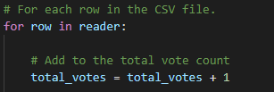

# Election-Analysis

## Overview of Project
To look at results for each candidate in Colorado and determine the votes, winners, and county votes. The results are on the csv file and will be outputed to text.
### Purpose
To use python and vs code congruently to pull the winning candidate in Colorado, and determine which county had the most votes.
## Analysis and Challenges
- **How many votes were cast in this congressional election?**
     

    To find each of the votes that were casted, I had to pull the files to be reviewed and edited. The reviewed file was the csv, which needed import csv to be added before pulling the file. That same csv file was the file to load. The second file was a text file where the programing would write onto.

     

    The next part was to define total votes and equal it to zero. This would provide a baseline that could be added to later in my for loop.

     

    I had to include code for the header to ensure that it did not begin counting on that row, but rather begin counting after that. This is the data from the csv file.

     

    I created a for loop that read through each row in the csv file, and added a code to tally up the total count after going row by row.

     

    The last portion was to export the information from the coding to a readable report. I first had to create the portion for Election Results with spacing. I then referenced total votes using fstring to combine my text and the count. One I closed that I printed the results and then adding coding to write this mini report in my text file. This gave me a result of 369,711 votes.

- **Provide a breakdown of the number of votes and the percentage of total votes for each county in the precinct.**
     

    First I had to initialize the list and dictionary. This will be added to later.

    

    Because I had already set up the header and reader, I justed needed to add the column name where the counties were. They were located in the second column so I input 1 within the row.

     

    I wrote an if stateemnt where it would add any county's name that was not on the list I had created. This also meant setting the county votes for each county to 0 and going row by row.

     

    Then I had to write a code for a for loop to retrieve the votes for each county that had been calculated, and use the total votes which was calculated in an earlier section, to divide county votes over total count and multiply by 100 that information. Then I had it print those results and write to the file.

    

    This was added to my election results to show the county votes variable referenced in my code above.
    The results show Jefferson county had 10.5% of votes with 38,855, which Denver having 82.8% of the vote with 306,055, and Arapahoe with 6.7% with 24,801 votes.

- **Which county had the largest number of votes?**

     

    This required information from counties in previous section to work. Here I had to set the turnout for each county along with the vote quantity which I set to zero so it could be added.

     

    I set up an if statement that looked at data set up before to identify which county had the highest turnout and what those votes looked like. I set up the variables for the report in the next section.

     

    I created a report based on data. I added the largest county turnout that pulled from the section above. I set up code to print out and write over the text file. This determined that Denver had the highest vote turnout. 

- **Provide a breakdown of the number of votes and the percentage of the total votes each candidate received.**

     

    Because the percentages were based on candidates, I also had to set up my list as candidate options and my dictionary which holds the votes for each.

     

    Similar to  what was done to review the data in the csv file,  I had to start reviewing candidate name and it was located in the third column so I used 2.

     

    Then I had to append to my list which meant adding any candidate name that was not in my canididate options would be added. This is also while simultaneously reviewing the number of votes for each candidate which required be to set the vote at 0 to add on to going row by row. This would essentially go row by row adding votes under each candidate in my list to obtain counts.

     

    Since I had already set up total votes, and I had added up votes for each in the previous section, I needed to run a for loop to identify the votes each candidate received, divide that by total votes which was also in float to limit the percentage, and multiply that by 100.

    Then I had to set up an f string that would be used to print the code by candidate name, their percentage vote, and how many votes that actually translated into.

    

    The next portion was just about printing that data and adding it to the text file I created, similar to the total votes. 

    This report showed that Charles Casper Stockham had 23% of the votes with 85, 213. It also showed Diana DeGette had 73.8% of the votes with 272,892 votes. Finally it showed Raymon Anthony Doana had 3.1% of the bote with 11,606 votes. 

- **Which candidate won the election, what was their vote count, and what was their percentage of the total votes**
     

    To calculate I had to create a variable for the winning candidate to use later and set both winning count and winning percentage to zero as I wanted these to total up and show in my report.

     

    The challenge also wanted us to illustrate which candidate won in a specially winner section along with this same information as in the election analysis - just written in a different format where winner was the defining word. This required me to create an if statement where the winning count votes, candidate, and vote percentage were coded for the output statement I created below.

     

    I had to create the report to be exported with the winning information and also write that to the text file. This information would pull information from the winner if statement and then print that out and write it on the text file.

## Election-Audit Summary and Challenges
- **Results** 

     

    Using different python techniques, some similar to VBA like for loops and conditional statements and some new like dictionaries and list creation, I was able to export a report to my text file on the election. I had to add a csv reader, define headers, and pull data to create the report which had f string that referenced code I had created. I also had to use /n for making it clearer and write on the next line, as well as dashes to nicely section off each section.

    All of these tools allowed me to output the election results. My report starts with county votes in each county, the county with the highest turnout, the candidates and each of the percentages, vote casted for them. The last postion was the winner's section which highlighted the winning candidate, vote count, and percentage in a nice little summary. All of this with sections and paragraph type spacing to allow for readability.
- **Future Use**

    This code could work for future elections. The important task would be ensuring the right file is chosen for the "file_to_load" and creating a new text file for the "file_to_save". All the other variables should work so long those two items are correct and that the file to load has simlar headers in the same order. If they didn't, the row related code would need to be updated to match the column

- **Challenges** 

    There were several challenges I experienced.
    The first was that the challenge py code had added ".." which meant to go back previous folders and was not allowing my code to run since it was trying to read a file that wasn't there. It took me a while to figure it out but once I did, I began working on the code.
    indenting is incredily important and that is something I had to learn. I had several times where I had up to 8 "problems" in running my code due to indentation. Sometimes in fixing one, I would break another so I needed to go line by line and make sure I wasn't missing anything.
    The hardest portion for my was the turnout calculation. This was mostly due since this whole project was new to me. I wasn't sure if I needed to create a new vote percentage specific to county (instead of using vote_percentage create a new county_vote_percentage). In the end I did not have to but it was difficult to wrap my head around at first.
    The final issue I ran into was simply not adding my turnout section fstrings for the report. I completely forgot to type out that information which lead to the last county, Arapahoe, to be printed again. I went to office hours and there someone pointed out this was missing. Once I corrected it, the code ran smoothly.
    One of the things I with this report had was the population that is registered to vote in those counties. Denver had the highest turn out, but that could be because that county has the most people.